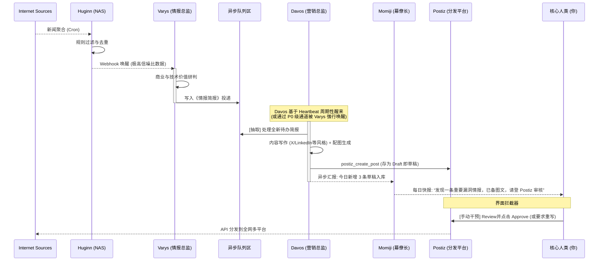

# OpenClaw 自动化营销系统架构：异步解耦与数据流转规范

在企业级 AI 自动化营销（AI Marketing Automation）场景中，系统强耦合（A 直接调用 B，B 直接发布）是必须避免的反模式。直接联动的架构在面对 API 抖动、模型幻觉或单节点过载时会产生雪崩效应。

为了建立一个稳定、安全、职责清晰的“情报获取 → AI 分析 → 内容创作 → 平台分发”流水线，我们应当采用基于**队列（Backlog）**和**人工复核（Draft）**的异步解耦架构。

## 1. 核心设计原则

1. **单向异步数据流**：上游系统只负责生产数据并投递到队列，下游系统依照自己的节奏（Cron Heartbeat）消费数据。
2. **能力专精隔离**：
   - **Varys（研究员）** 的 Token 额度和 Prompt 用于“认知与洞察”（Cognitive Work）。
   - **Davos（营销总监）** 的 Token 额度和 Prompt 用于“共情与表达”（Creative Work）。
3. **设置安全界限（Safety Valve）**：所有 AI 生成的对外公开发布，必须以 Draft（草稿）状态进入发布系统，或引入不可见的人类复核环节。

---

## 2. 角色分工与职责拆解

### 节点 1：感知层 —— Huginn (Synology NAS)
* **角色定位**：不知疲倦的数字雷达。
* **主要职责**：
  - 7x24 小时监控配置好的 RSS、网站变动、竞品动态。
  - 使用预设规则（如关键词提取、正则表达式）过滤掉 90% 的垃圾噪音。
* **数据流向**：当匹配到极具价值的情报（如 CVSS >= 9 漏洞、核心竞品大版本更新）时，通过 Webhook 将原始素材推送给 OpenClaw Gateway（`POST /hooks/agent`）。
* **禁止行为**：禁止在 Huginn 内部进行大语言模型推理（耗时且容易 OOM）。

### 节点 2：认知层 —— Varys (OpenClaw - researcher)
* **角色定位**：商业与技术情报分析师。被 Huginn 唤醒后执行单次任务。
* **主要职责**：
  - 消费 Huginn 推送的**事实数据**。
  - 交叉验证信息，提取核心突破点。
  - 与自身业务（Arcana/OpenClaw 等）进行关联，产出**《情报价值简报》**。
* **数据流向**：将《情报价值简报》追加写入（Append）到共享硬盘的异步队列文件中（例如：`~/.openclaw/workspace-shared/content-backlog.md`）。
* **禁止行为**：禁止使用 `agentToAgent` 同步打断 Davos；禁止直接思考“推文该怎么写”。

### 节点 3：表达层 —— Davos (OpenClaw - adm)
* **角色定位**：首席营销官官。不随上游波动，按照固定节奏（如每天上午 10:00）苏醒。
* **主要职责**：
  - 读取 `content-backlog.md` 队列卡片，提取可用简报。
  - 针对具体的社交平台（X 偏简练、LinkedIn 偏深度商业思考、小红书偏情绪配图），将枯燥的简报重组为多语言、多风格的原生内容。
  - 调用 `image-generation` 生成配图。
* **数据流向**：调用 `postiz_create_post` (Plugin 工具 API)，将内容推送到分发底座。
* **安全约束**：向 Postiz 发送 API 时，必须标记为 `isDraft: true` 或设置到未来的调度时间（Schedule），预留拦截窗口。

### 节点 4：分发与基建层 —— Postiz (Synology NAS)
* **角色定位**：通道基建（Pipes）。
* **主要职责**：
  - 维护全球 28+ 社交媒体的 OAuth 刷新、长效 Session 保持。
  - 处理各平台的速率限制（Rate Limits）、图片大小裁剪、视频编码等脏活。
  - 提供数据看板（Analytics Dashboards）。
* **最终闭环**：团队的人类运营者唯一需要查看的界面。在此界面内批量点击“Approve”（批准）即可。

### 节点 5：管理与接口层 —— Momiji (幕僚长)
* **角色定位**：战略总监与人机交互入口。
* **主要职责**：
  - **战略定调（Top-down Directives）**：你可以像老板一样对 Momiji 说：“接下来一周，Varys 和 Davos 的重点放在 AI 芯片领域”。Momiji 会把这个偏好下达到他们的 `USER.md` 或直接调用 `agentToAgent` 设定当期目标。
  - **结果汇总（Review & Reporting）**：Davos 在 Postiz 存入草稿后，可以在他每天晚上的 Heartbeat 中向 Momiji 发送《今日发推草稿清单》。Momiji 会为你生成每日摘要报告（“老板，Davos 已经准备好了 5 条关于 Apple 漏洞的推文，存放在 Postiz，请在空闲时确认”）。
  - **人工接管（Override）**：如果不方便登录 Postiz 后台，你可以直接通过 Telegram 对 Momiji 下达命令：“审一下 Davos 第二条草稿的语气并直接要求他改成更激进的风格”。

---

## 3. 完整生命周期数据流（时序图）

## 4. 特例：P0 级紧急通讯通道

只有在遇到关乎生死、重大 PR 危机、或绝对现象级且需要抢首发（如 ChatGPT-5 发布、室温超导确认）的消息时，才启动同步打断协议：
1. Huginn 的过滤规则将 payload 标记为 `priority: P0`。
2. Varys 判定属于 P0，且效期极短。
3. Varys 读取 `AGENTS.md` 中的**《突发新闻通讯协议》**，调用 `agentToAgent` 直接强制拉起 `adm` (Davos)。
4. Davos 紧急生成短平快的文字突发推文。
5. （可选风险操作）由 Davos 直接通过 Postiz 发布跳过审查。

## 5. 动态情报源管理（Dynamic Sensor Tuning）

系统稳定运行后，谁来维护 Huginn 中成百上千的监控节点（Agents），以保证信息搜集的广度不会固化？

**答案是：Varys 和 Momiji 配合，通过 Huginn REST API 动态热更规则。**

1. **战略偏移**：作为老板（You），你告诉 Momiji：“下个月我们要办一场出海营销 Webinar，去盯一下友商最近在这个话题上的动作。”
2. **下达指令**：Momiji 理解了业务焦点的转移，通过 `agentToAgent` 将新的追踪坐标轴发给 Varys。
3. **调用工具**：Varys 收到指令后，分析出需要监控的目标网站和关键词组，然后使用他自带的 HTTP/REST 工具能力，调用 Huginn 的 `/api/v1/agents` 接口。
4. **生成探针（Sensors）**：
   - Varys 发送 JSON payload，在 Huginn 内部自动创建几个全新的 `WebsiteAgent`（去爬取竞品的 webinar 页面）和 `TriggerAgent`（仅当出现特定关键词时放行）。
   - 将新探针链接到现有的 `Webhook PostAgent` 节点上。
5. **动态回收**：当该战役（Campaign）结束后，Varys 同样可以通过 API 向 Huginn 发送 `DELETE` 请求，回收这些短期服役的监控节点。

这使得 OpenClaw 的情报触角不仅能够自动处理流回来的数据，还能根据业务需要，主动向互联网这个池塘中抛设新的“渔网”。

## 6. 为什么要如此设计？

- **容错极强**：如果 Davos 因为模型 API 限流、停机升级或 Postiz API Token 过期导致无法工作。Varys 也能继续将外网的情报源源不断地积累在本地仓库中，一条不丢。一旦系统恢复，Davos 醒来就可以全盘消费。
- **防止串行死锁**：如果 Varys 因为撰写深度的安全漏洞研判花费了 90 秒，再同步唤醒 Davos 写作 90 秒，整个调用链达到了 3 分钟。对于基于 Webhook 触发的模型，这极易触发超时错误。
- **管理安全半径**：营销是商业组织的脸面。AI 的强项是 10 秒打 100 份高质量草稿，人类的强项是 1 秒钟判断这篇帖子发出去有没有公关危机。让 Postiz 作为水坝，卡住最后一道关口，既实现了自动化的高产能，又保全了零事故的安全底线。
